# Bulk Edit App - Logic Flow Documentation

This document describes the architecture, logic flow, and key components of the Bulk Edit Contentful App.

## Table of Contents

- [Overview](#overview)
- [Architecture](#architecture)
- [Component Structure](#component-structure)
- [Data Flow](#data-flow)
- [Key Features](#key-features)
- [State Management](#state-management)
- [API Interactions](#api-interactions)

---

## Overview

The Bulk Edit app enables users to edit multiple entry fields simultaneously within a Contentful space. It provides a spreadsheet-like interface for selecting and modifying field values across entries of a selected content type.

### Key Capabilities

- Browse and filter entries by content type
- Search entries with text and numeric queries
- Filter by entry status (Draft, Changed, Published)
- Select individual cells or entire columns for bulk editing
- Apply the same value to multiple selected entry fields
- Undo bulk edit operations
- Field validation before saving

---

## Architecture

### High-Level Application Flow

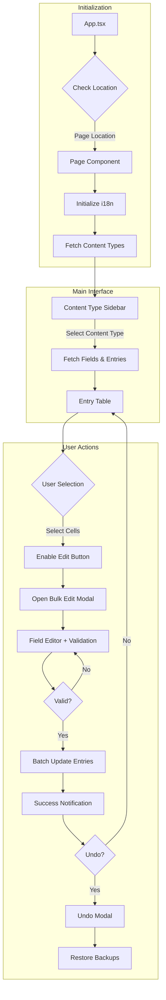

---

## Component Structure

### Component Hierarchy

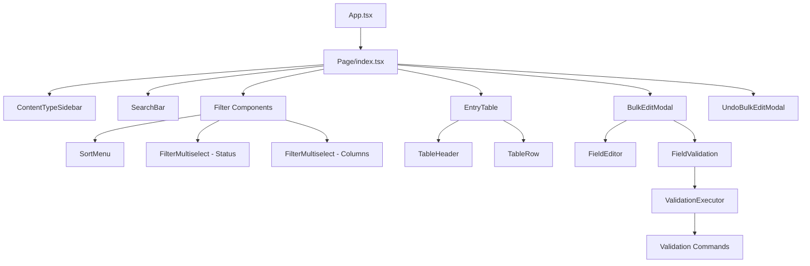

### Component Responsibilities

| Component            | Responsibility                                 |
| -------------------- | ---------------------------------------------- |
| `Page`               | Main orchestrator, state management, API calls |
| `ContentTypeSidebar` | Content type navigation and selection          |
| `SearchBar`          | Text/numeric search with debouncing            |
| `FilterMultiselect`  | Status and column filtering                    |
| `SortMenu`           | Entry sorting options                          |
| `EntryTable`         | Virtual scrolling table with selection         |
| `TableHeader`        | Column headers with bulk selection             |
| `TableRow`           | Individual entry row with cell checkboxes      |
| `BulkEditModal`      | Field editing interface                        |
| `FieldEditor`        | Dynamic field type editors                     |
| `FieldValidation`    | Real-time validation display                   |
| `UndoBulkEditModal`  | Undo confirmation dialog                       |

---

## Data Flow

### Content Type and Entry Loading

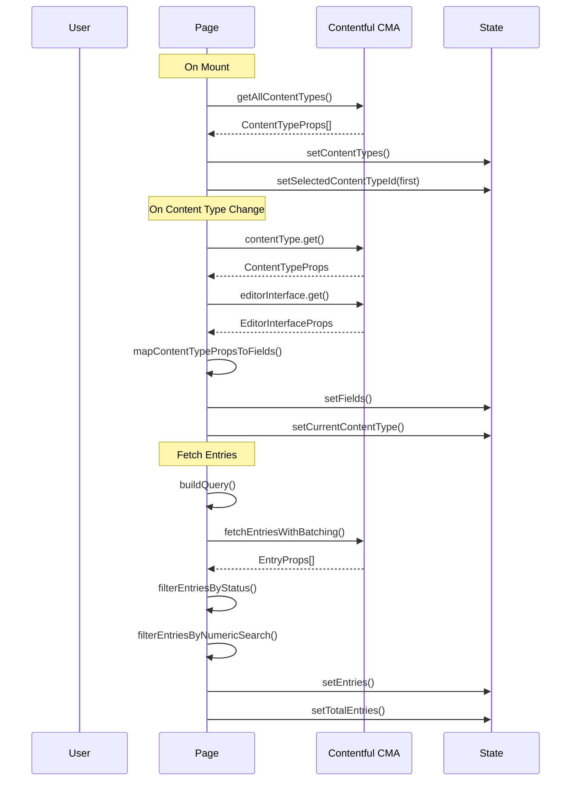

### Entry Fetching Strategy

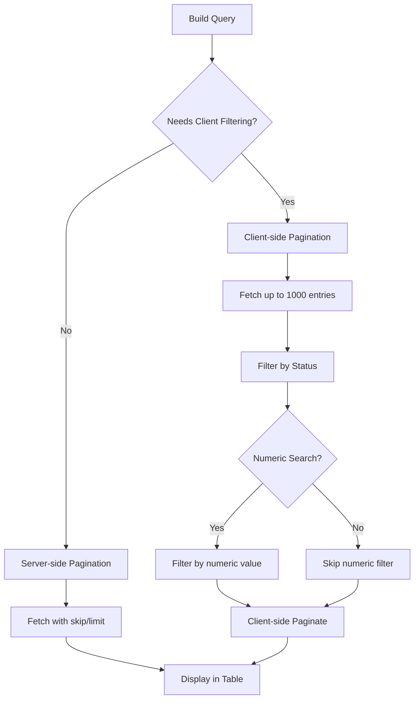

---

## Key Features

### Cell Selection and Keyboard Navigation

```mermaid
stateDiagram-v2
    [*] --> NoFocus: Page Load

    NoFocus --> CellFocused: Click Cell
    CellFocused --> CellFocused: Arrow Keys
    CellFocused --> RangeSelected: Shift+Arrow
    CellFocused --> ColumnSelected: Alt+Space
    RangeSelected --> RangeSelected: Shift+Arrow
    RangeSelected --> CellFocused: Arrow (no shift)
    ColumnSelected --> CellFocused: Arrow Key
    CellFocused --> NoFocus: Escape
    RangeSelected --> NoFocus: Escape

    CellFocused --> CheckboxToggled: Space
    CheckboxToggled --> CellFocused: Complete
```

#### Keyboard Shortcuts

| Key                 | Action                 |
| ------------------- | ---------------------- |
| Arrow Keys          | Navigate cells         |
| Shift + Arrow       | Extend selection range |
| Alt + Shift + Arrow | Select to edge         |
| Alt + Space         | Select entire column   |
| Space               | Toggle cell checkbox   |
| Tab                 | Move to next cell      |
| Escape              | Clear focus            |

### Bulk Edit Flow

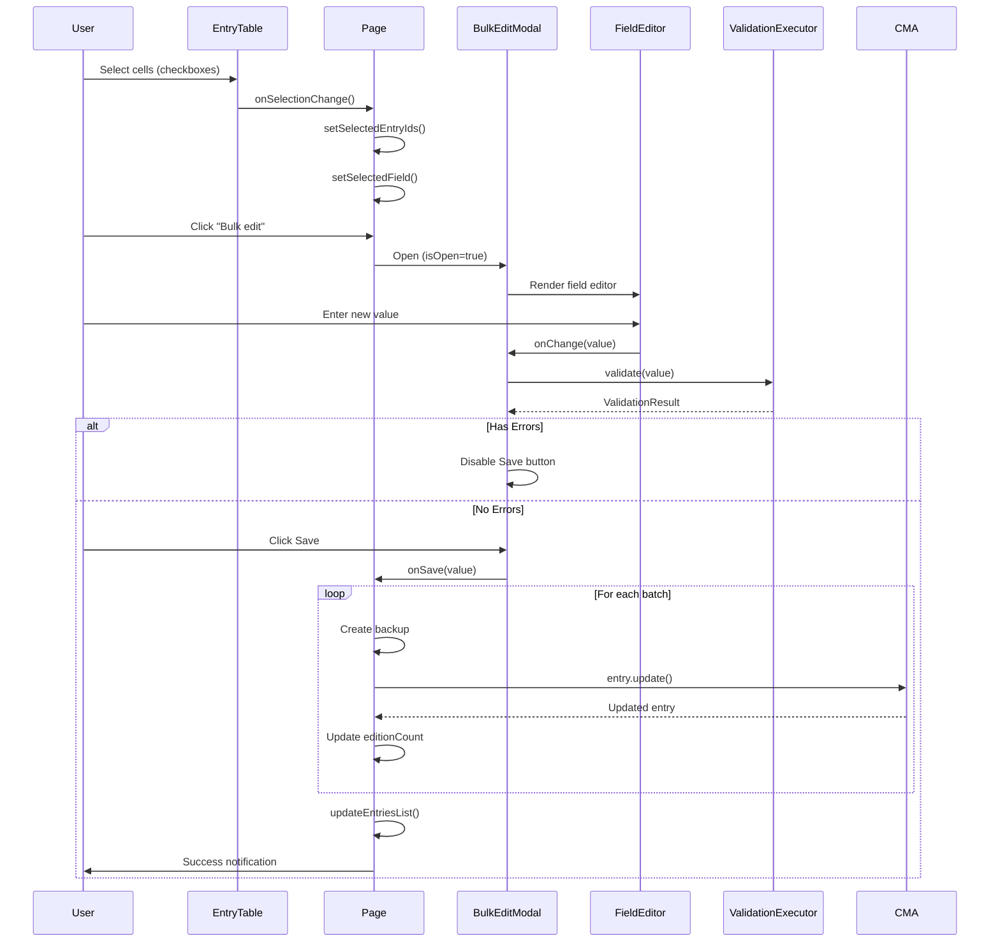

### Undo Operation Flow

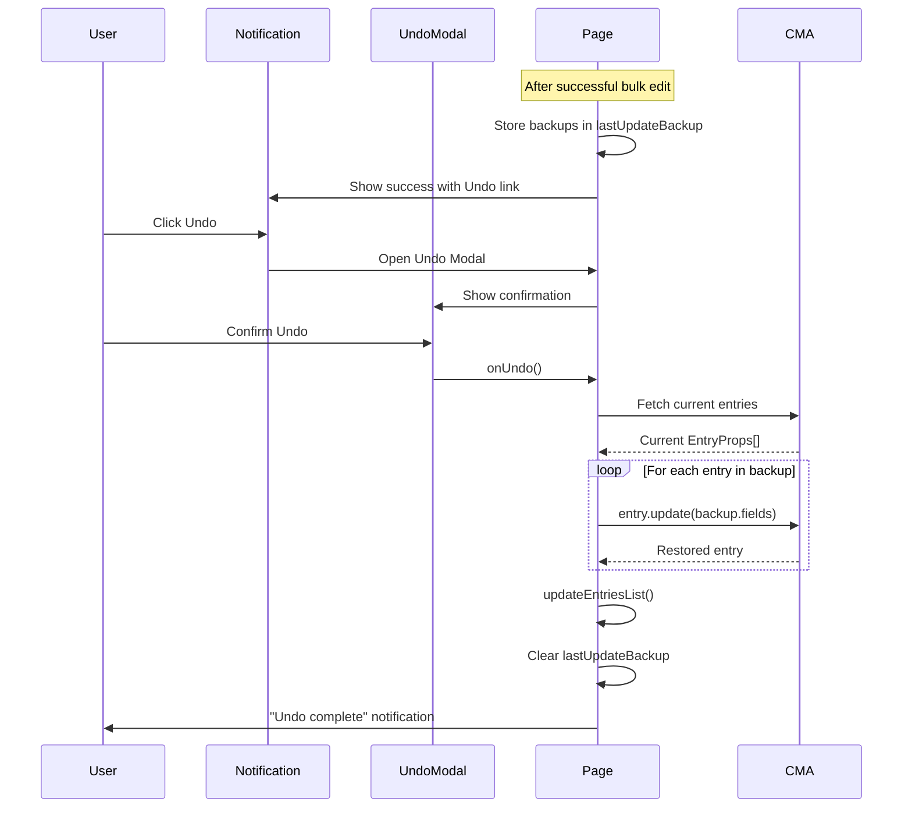

---

## State Management

### Main Page State

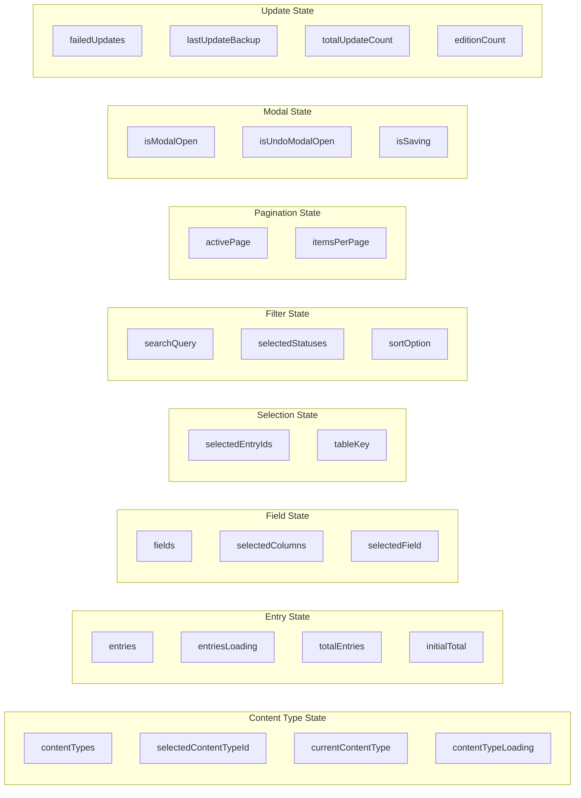

### State Update Triggers

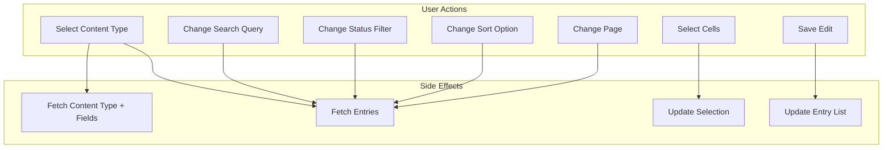

---

## API Interactions

### Batch Processing Strategy

The app uses batch processing to handle Contentful API rate limits:

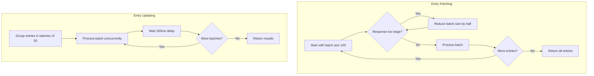

### API Constants

| Constant                      | Value | Purpose                          |
| ----------------------------- | ----- | -------------------------------- |
| `DEFAULT_BATCH_SIZE` (fetch)  | 100   | Entries per fetch batch          |
| `MIN_BATCH_SIZE`              | 2     | Minimum batch size on errors     |
| `DEFAULT_BATCH_SIZE` (update) | 50    | Entries per update batch         |
| `DEFAULT_DELAY_MS`            | 200   | Delay between update batches     |
| `DEFAULT_PAGINATION_LIMIT`    | 1000  | Max entries for client filtering |

---

## Validation System

### Validation Architecture

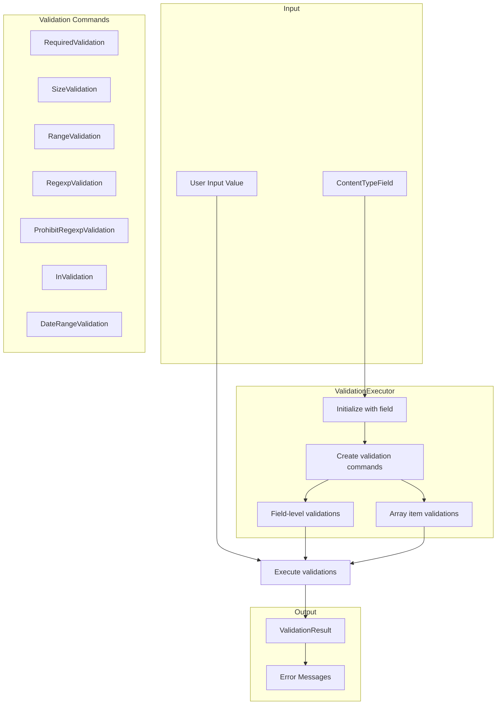

### Validation Command Pattern

Each validation type implements the `ValidationCommand` interface:

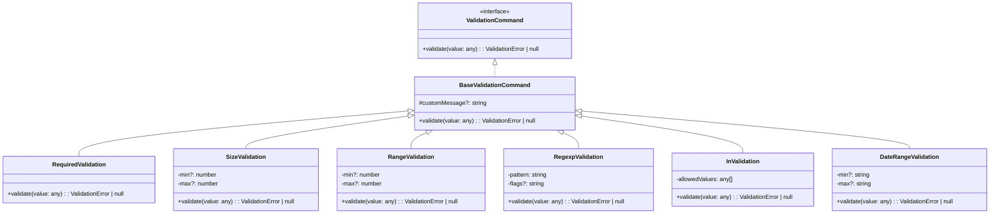

---

## Field Editor System

### Supported Field Types and Editors

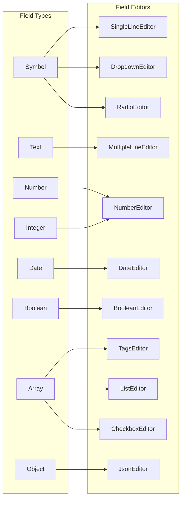

### Non-Editable Field Types

The following field types cannot be bulk edited:

- Location
- Link (Asset/Entry references)
- ResourceLink
- RichText
- Arrays of references (Entry/Asset links)

---

## Entry Status Logic

### Status Determination

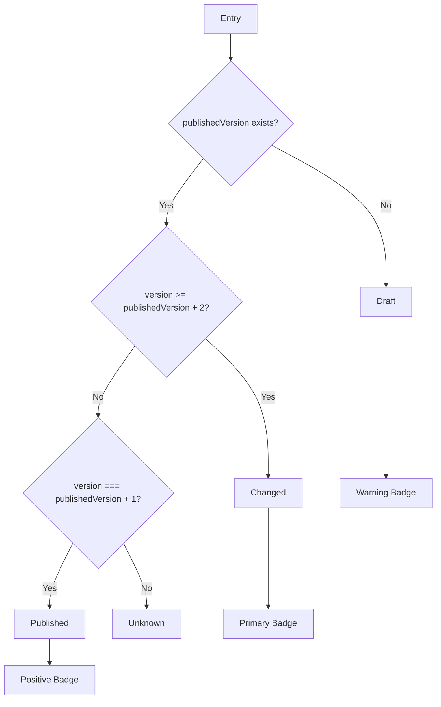

### Status Filtering Logic

| Selected Statuses   | API Filter                  | Client Filter       |
| ------------------- | --------------------------- | ------------------- |
| Draft only          | `publishedAt[exists]=false` | None                |
| Published only      | `publishedAt[exists]=true`  | Filter to Published |
| Changed only        | `publishedAt[exists]=true`  | Filter to Changed   |
| Published + Changed | `publishedAt[exists]=true`  | None                |
| All statuses        | None                        | None                |

---

## Error Handling

### Update Error Flow

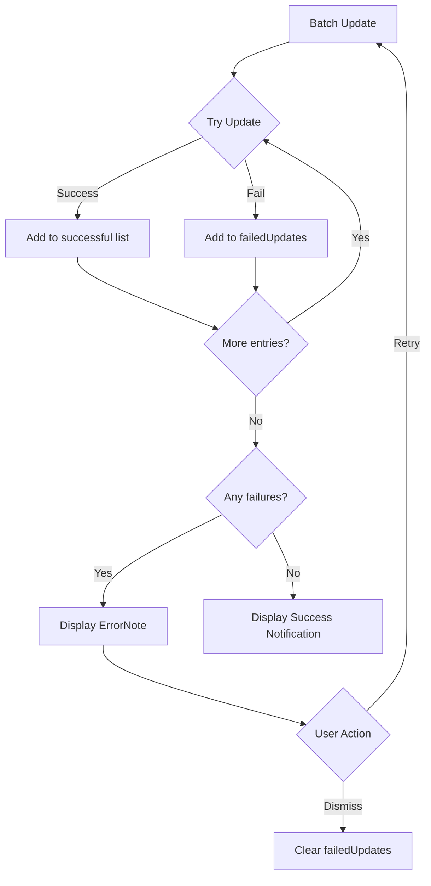

---

## Performance Optimizations

### Virtual Scrolling

The `EntryTable` component uses `@tanstack/react-virtual` for efficient rendering of large entry lists, only rendering visible rows.

### Debounced Search

The `SearchBar` component debounces user input (300ms default) to prevent excessive API calls during typing.

### Batch Processing

- Entry fetching uses adaptive batch sizes, reducing on response size errors
- Entry updates process in batches of 50 with 200ms delays to respect rate limits

### Memoization

- Field mappings are memoized to prevent unnecessary recalculations
- Field API objects are memoized in FieldEditor to prevent recreation
